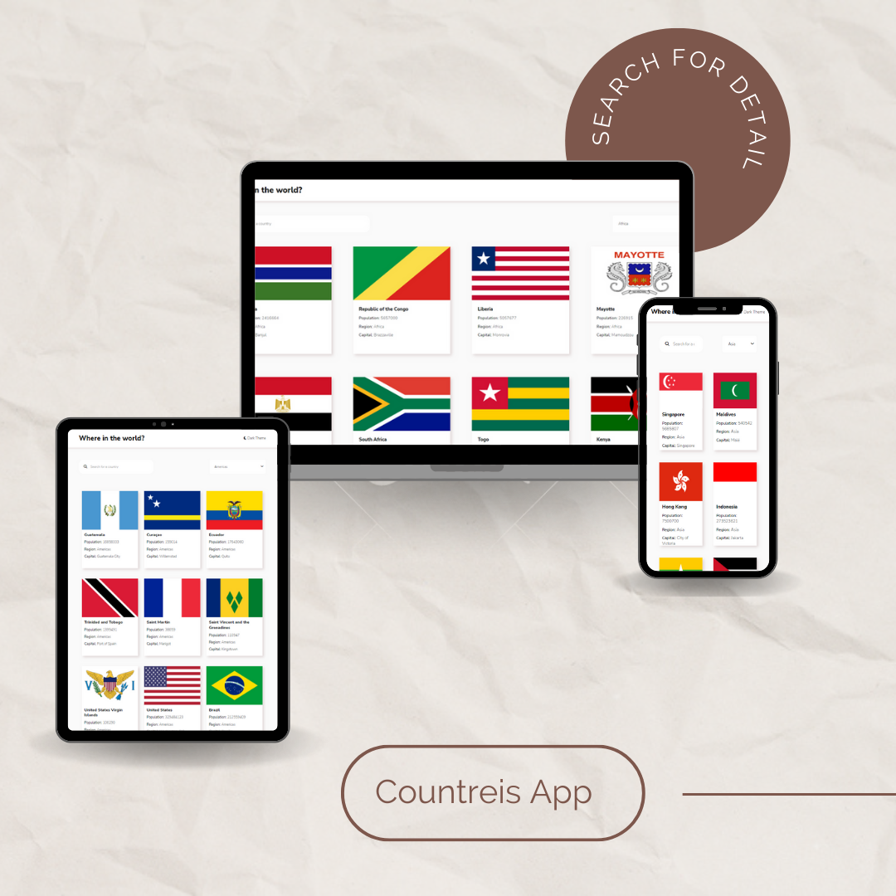

# Countries App

A simple countries app that integrating with the REST Countries API to pull country data and display using design from FrontEnd Mentor.

<p align="center"></p>

### Your users should be able to:

- See all countries from the API on the homepage
- Search for a country using an input field
- Filter countries by region
- Click on a country to see more detailed information on a separate page
- Toggle the color scheme between light and dark mode.

# Getting started

- Fork the project and clone it locally.
- Install dependencies using npm:

  ```sh
  npm install
  ```

  - Start the project :

  ```sh
  npm start
  ```

  # APIs

- All countries details and information are retrieved from [Rest Countries](https://restcountries.com/)
